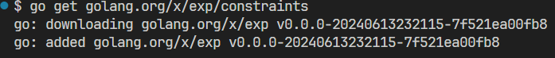
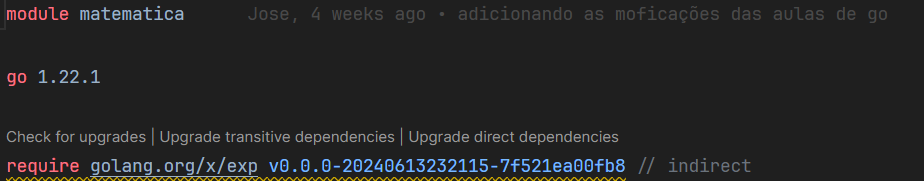
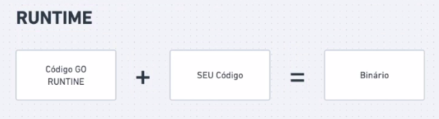

'# Introcução a Linguagem golang

A extensão usada pela linguagem é o .go. 

O primeiro passo para que o arquivo seja executavél é a utilização do:

```go

package main  // usado para dizer onde esta o pacote a ser usado 

import (
     "fmt"
)
   

//Para o Go toda função precisa ter uma função man para executar os códigos 


func main(){

    fmt.Println("Olá, mundo!")

}


```

No go todos os programas são organizados em pacotes, um pacote é um grupo de arquivos que estão em um mesmo local e eles são compilados juntos. Dessa forma todos os arquivos serão compartilhados entre todos os pacotes. No programa acima podemos vê como se criar um código simples que mostre a mensagem olá mundo.

Um outro exemplo simples: 

```go
package main // usado para dizer onde esta o pacote a ser usado

import (
	"fmt"
	"math/rand"
)

func main() {
	fmt.Println("my favorite Number is", rand.Intn(10))
}

```

### Variavéis no GO

Para declaramos uma variavel podemos usar a palavra reserva da linguagem **var** e logo após o tipo de dado ao qual a variavel irá receber.

Exemplo: ``` nome var string ```

A instrução ```var``` pode ser usada no escopo de pacote ou de método/função, a instrução var pode incluir inicializadores, um por variável. Neste caso, não é necessário informar o tipo pois o mesmo será inferido.

```go 
package main

import(
	"fmt"
	"math"
)


var  c, python, java

func main (){
	var i int 
	fmt.Println(i, c, python, java)
}


```

* Dentro de uma função, o operador de declaração curta **:=** , pode ser usado ao invés do operador var, ao usar o operador de declaração curta o mesmo iniciará as variáveis

Digitando o comando ```go env``` é possível vê as variaveis de ambiente do go. O código  ```GOPATH: endereço go``` serve para guardar os binarios implementados. Todos os *packages* usados no GO teram que possuir o mesmo nome da pasta onde o arquivo esta armazenado, tirando o *main* pois é onde estará as principais funções 
P
#### Declarando uma variavel 

```Go

package main 

const a = "Hello Wolrd"

var b bool

b = true 

func main(){
	println(b)
}

```

```Go 
//Declaração de Escobo Global 

var (
	c int
	b bool
)
```

Variaveis e Importes que não são usados o Go gera um erro. É possível ainda declarar variaveis na forma de sort slice é usado para simplificar as declarações de variaveis.

```Go

package main 


func main(){
	a := "Felix" //Tipo String
	b := 23 // Tipo int

	println(a)
}
```

# Tipagem de dados em GO

```GO
package main

const a = "Hello Wolrd"
type ID 

var (
	c int     = 9
	b bool    = true
	d float64 = 2.3
	e string  = "Felix"
	f ID = 1 
)

func main() {
	b = true
	println(b)
	println(c)
}

```

O "fmt" é um pacote usado para formatação dos dados exibidos

```GO
package main

import "fmt"

const a = "Hello Wolrd"
type ID int 

var (
	c int     = 9
	b bool    = true
	d float64 = 2.3
	e string  = "Felix"
	f ID = 1 
)

func main() {

	fmt.print("Esse é o tipo de %t", f)
}

```

### Array, Slice, maps no GO

Um array é como uma variavel "lista" na qual podemos armazena algum tipo de dentro da mesma, abaixo poderemos vê como declarar um array em Go.

```var meuArray [3]int``` => logo podemos vê que meuArray:= [3]int => "nome := [tamanho]tipo"

```Go

package main

import "fmt"


func main() {
	var meuArray [3]int

	meuArray[0] = 10
	meuArray[1] = 20
	meuArray[2] = 30

	//Percorrendo o Array
	// o for usa o indice e o valor, e também o range que é usado para percorrer todo o array

	for i, v := range meuArray{
		fmt.Println("Percorrendo o array/vetor %d no indice com valor %d", i,v)
	}
}


```
Obs: O array possui tamanho Fixo, após sua criação

#### Slice 

O slice é um tipo de array, que possui um ponteiro e uma capacidade.

``` meuArray := []int {10, 9, 8, 7, 6, 5, 4, 3, 2, 1, 0}``` => nome := []tipo {valor1, valor2, valor3 ...}

```Go
package main

import "fmt"

func main() {

	s := []int{10, 9, 8, 7, 6, 5, 4, 3, 2, 1, 0}

	fmt.Printf("len=%d cap=%d %v \n", len(s), cap(s), s)
}
```

Podemos usar o ```len(s[:0]) para fazer com que todos os dados inseridos a direita no slice sejam desconsiderados ou zerados.

```Go
package main

import "fmt"

func main() {


	s := []int{100, 90, 80, 70, 60, 50, 40, 30, 20, 10, 0}

	fmt.Printf("Ignora tudo apos : len=%d cap=%d %v \n", len(s[:0]), cap(s[:0]), s[:0])

	fmt.Printf("Ignora apos os 4 primeiros len=%d cap=%d %v \n", len(s[4:]), cap(s[:4]), s[:4]) //Reduziu  a capacidade

	fmt.Printf("Ignora os 2 primeiros len=%d cap=%d %v \n", len(s[2:]), cap(s[2:]), s[2:])


}
```

**Saída:** 


```s = append(s, 110) ``` Usado para adcionar valores no slices, e redimensiona o slice dobrando o tamanho.


### maps ou hashtable 

```Go

package main

import "fmt"

func main() {

	salario := map[string]int{"Felix": 700, "Tadeu": 3200, "Natalia": 20000}

	fmt.Println("O salario do Funcionario é: ", salario["Felix"])

	delete(salario, "Felix")
	salario["felix"] = 1000

	fmt.Println("Apos ser contratado o salario do Funcionario é: ", salario["felix"])
}


``` 

A função ```make``` pode ser usada para criar uma determinada variavel e inicializar as variaveis

```go
package main

import "fmt"

func main() {

	salario := map[string]int{"Felix": 700, "Tadeu": 3200, "Natalia": 20000}

	fmt.Println("O salario do Funcionario é: ", salario["Felix"])

	delete(salario, "Felix")
	salario["felix"] = 1000

	fmt.Println("Apos ser contratado o salario do Funcionario é: ", salario["felix"])

	sal := make(map[string]int)
}
```


O blank identi fier "_" é usado para ignorar uma das seções do ```for``` e manter o seu funcionamento mesmo sem esse componente.

```Go

package main

import "fmt"

func main() {

	salario := map[string]int{"Felix": 700, "Tadeu": 3200, "Natalia": 20000}

	fmt.Println("O salario do Funcionario é: ", salario["Felix"])

	delete(salario, "Felix")
	salario["felix"] = 1000

	fmt.Println("Apos ser contratado o salario do Funcionario é: ", salario["felix"])

	sal := make(map[string]int)

	sal["Felix"] = 1000

	for nome, salario := range salario {
		fmt.Printf("O salario é de %s e %d\n", nome, salario)
	}

	for _, salario := range salario {
		fmt.Printf("O salario é de %s e %d\n", nome, salario)
	}
}

```


### Funções no GO 

Passa dados na entrada e sai dados na saida e todas as suas possibilidades possiveis de entrada e saida 

**Exemplo**

```Go

// Aula Sobre Funções no GO

// Função main
package main

import "fmt"

func main() {

	//Chamando a função em GO
	a := sum(1, 2)

	fmt.Printf("Func Soma = %d \n", a)
	// Imprimindo e fazendo a chamada

	fmt.Printf("O valor da função soma é %d", sum(1, 2))

}

// Primeira função em Go
func sum(a int, b int) int {
	return a + b
}

// Se a e b são do mesmo tipo podemos fazer da seguinte forma

func sum(a, b int) int{
	return a + b
}
```

No Go é possível que uma função retorne mais de um valor ao mesmo tempo: 

```Go
func sum(a, b int) (int,bool){
	if a + b >= 50{
		return a + b, true
	}
	
	return a + b, false 
}
```
O GO não possui as funções de resolução de erro. A função error é uma função usada para solução de problemas e correções de bugs com retorno.

```Go
func sum(a, b int) (int,error){
	if a + b >= 50{
		return a + b, true
	}
	
	return 0, new.error("A soma é menor que 50") 
}
```

Voce pode utilizar o ultimo valor de uma função para verificar se houve um erro na função, assim usando o error como tratamento de dados.
```GO
// Aula Sobre Funções no GO

// Função main
package main

import (
	"errors"
	"fmt"
)

func main() {

	//Chamando a função em GO
	//a := sum(1, 2)

	//fmt.Printf("Func Soma = %d \n", a)
	// Imprimindo e fazendo a chamada

	//fmt.Println(sum(105, 2))

	//Criando uma nova variavel para armazenar o valor e outra para o error
	valor, err := sum(51, 10)

	if err != nil {
		fmt.Println(err)
	}

	fmt.println(valor)

}

// Primeira função em Go
//func sum(a, b int) (int, bool) {
//	if a+b >= 50 {
//		return a + b, true
//	}

//	return a + b, false
//}

func sum(a, b int) (int, error) {
	if a+b >= 50 {
		return a + b, nil // O erro aqui é vazio logo não existe
	}

	return 0, errors.New("A soma é menor que 50")
}
```

# Funções Variadicas

São funções que vem implementadas junto a propria linguagem GO e podem ser usadas pelos programadores em suas atividades.

```GO


func sum(numetos ...int) int { // Essa forma é usada quando não sabemos a qualidade de dados da entrada 

}
```

Dessa forma pode ser feito um Loop dentro dos parâmentros usados, de forma a usar uma infinidade de dados da entrada.

```Go

// Aula Sobre Funções no GO

// Função main
package main

import (
	"fmt"
)

func main() {
	fmt.Println(sum(3, 4, 5, 6, 7, 10)) // Chamando a  função soma.
}

func sum(numeros ...int) int { // usado para uma entrada de n itens
	total := 0                       // instanciando uma variavel pra ser usada como controle
	for _, numero := range numeros { // for entrada_não_instanciar, numero(nova_variavel) := range(usada percorrer todos os numeros)
		total += numero // total vai receber a atualização de numero
	}
	return total // retorna a soma de todos os numeros
}

```
Exemplo usando alguma das informações das aulas anteriores. 


**range** pode ser usada para percorrer um dado elemento, ou parametro de entrada.

Podemos fazer uma função que possa ser chamada dentro da propria main 

```Go
func main() {

	// podemos fazer também uma função que chame uma outra função dentro da propria main
	total := func() int {
		return sum(10, 20, 30, 40, 50) * 2
	}() // forma correta de instanciar

	fmt.Println(sum(3, 4, 5, 6, 7, 10)) // Chamando a  função soma.
}

```

Exemplo: 

```Go 

// Aula Sobre Funções no GO

// Função main
package main

import (
	"fmt"
)

func main() {

	// podemos fazer também uma função que chame uma outra função dentro da propria main
	total := func() int { // a variavel total vai executar uma função e receber o valor de retorno
		return sum(10, 20, 30, 40, 50) * 2
	}() // forma correta de instanciar

	fmt.Println(total) // Chamando a  função soma.
}

func sum(numeros ...int) int { // usado para uma entrada de n itens
	total := 0                       // instanciando uma variavel pra ser usada como controle
	for _, numero := range numeros { // for entrada_não_instanciar, numero(nova_variavel) := range(usada percorrer todos os numeros)
		total += numero // total vai receber a atualização de numero
		fmt.Printf("valor atual %d \n", total)
	}
	return total // retorna a soma de todos os numeros
}

```


# Structs 

Obs: O go não é uma linguagem orientada a objetos 

O struct no Go seria o mais proximo na linguagem de uma `class` em outra linguagem, mas lembrando uma struct não é uma classe.

```go 
// Aula sobre Struct
package main

import "fmt"

type Cliente struct {
	// Estrutura de dados usada para um cliente qualquer
	Nome  string
	Idade int
	Ativo bool
}

func main() {
	// Intanciando um Cliente
	felix := Cliente{
		Nome:  "Felix",
		Idade: 28,
		Ativo: true,
	}

	fmt.Printf("Nome: %s, Idade: %d, Ativo: %t", felix.Nome, felix.Idade, felix.Ativo)

}

```

No Go não é possível usar herança, mas é possível usar composição para fazer o mesmo papel. Uma struct pode ser usada como um tipo dentro de outra, dessa forma além da composição poderá ser usada como um tipo dentro de outra struct.


**Usando como tipo**

```GO
type Cliente struct {
	// Estrutura de dados usada para um cliente qualquer
	Nome   string
	Idade  int
	Ativo  bool
	Adress Endereco // Instanciando a estrutura endereço
}

```

**Usando como Composição**

```GO
type Cliente struct {
	// Estrutura de dados usada para um cliente qualquer
	Nome   string
	Idade  int
	Ativo  bool
	Endereco // Instanciando a estrutura endereço
}

``` 


#### Exemplo

```GO

// Aula sobre Struct
package main

import "fmt"

type Endereco struct {
	Logradouro string
	Numero     int
	Cidade     string
	Estado     string
}

type Cliente struct {
	// Estrutura de dados usada para um cliente qualquer
	Nome   string
	Idade  int
	Ativo  bool
	Adress Endereco // Instanciando a estrutura endereço
}

func main() {
	// Intanciando um Cliente
	felix := Cliente{
		Nome:  "Felix",
		Idade: 28,
		Ativo: true,
	}

	//felix.Cidade = "Santa Cruz" // usando struct como composição
	felix.Adress.Numero = 45 // usando struct como tipo

	fmt.Printf("Nome: %s, Idade: %d, Ativo: %t, Numero: %d", felix.Nome, felix.Idade, felix.Ativo, felix.Adress.Numero)

}

``` 

## Métodos de Struct 

Uma Struct também possui metodos.

```GO

// Aula sobre Struct
package main

import "fmt"

type Endereco struct {
	Logradouro string
	Numero     int
	Cidade     string
	Estado     string
}

type Cliente struct {
	// Estrutura de dados usada para um cliente qualquer
	Nome   string
	Idade  int
	Ativo  bool
	Adress Endereco // Instanciando a estrutura endereço
}

func (c Cliente) Desativar() { // Dessa forma esta sendo criado um método que pode mudar o valor de uma struct
	// Criar um metodo para mudar um valor já ativo
	c.Ativo = false // Levar o cliente para False
	fmt.Printf("O usuario  %s foi Desativado %t.\n", c.Nome, c.Ativo)
}

func main() {
	// Intanciando um Cliente
	felix := Cliente{
		Nome:  "Felix",
		Idade: 28,
		Ativo: true,
	}
	//felix.Cidade = "Santa Cruz" // usando struct como composição
	felix.Adress.Numero = 45 // usando struct como tipo

	felix.Desativar() // chamando o metodo criado

	fmt.Printf("Nome: %s, Idade: %d, Ativo: %t, Numero: %d", felix.Nome, felix.Idade, felix.Ativo, felix.Adress.Numero)

}
```

A cima podemos vê um exemplo de utilização de uma  função para alterar uma struct de maneira semelhante ao que seria um metodo de uma class.


# Interfaces 

No caso do Go não precisa ser feito uma atachment para a implemetação de uma interface em uma estrutura, nos possibilitando utilizar diversos tipos de uma forma mais simples abstraindo muitas informações na hora implementação. De forma simples qualquer  metodo criado, caso o mesmo possua uma interface o mesmo poderá ser implementado, veja no exemplo a seguir.

```GO

// Aula sobre Struct
package main

import "fmt"

type Pessoa interface { // Exboço de uma interface em Go
	Desativar()
}

type Empresa struct {
	Nome string
}

func (e Empresa) Desativar() {

}

type Endereco struct {
	Logradouro string
	Numero     int
	Cidade     string
	Estado     string
}

type Cliente struct {
	// Estrutura de dados usada para um cliente qualquer
	Nome     string
	Idade    int
	Ativo    bool
	Endereco // Instanciando a estrutura endereço
}

func (c Cliente) Desativar() { // Dessa forma esta sendo criado um método que pode mudar o valor de uma struct
	// Criar um metodo para mudar um valor já ativo
	c.Ativo = false // Levar o cliente para False
	fmt.Printf("O usuario  %s foi Desativado %t.\n", c.Nome, c.Ativo)
}

func Desativacao(pessoa Pessoa) {
	pessoa.Desativar()
}

func main() {
	// Intanciando um Cliente
	felix := Cliente{
		Nome:  "Felix",
		Idade: 28,
		Ativo: true,
	}

	minhaEmpresa := Empresa{}
	//felix.Cidade = "Santa Cruz" // usando struct como composição
	felix.Numero = 45 // usando struct como tipo

	Desativacao(minhaEmpresa)

	fmt.Printf("Nome: %s, Idade: %d, Ativo: %t, Numero: %d", felix.Nome, felix.Idade, felix.Ativo, felix.Numero)

}
```

Uma observação importante é que a interface no GO permite apenas a utilização de metodos feitos, logo declarações de variaveis e outros exemplos, não podem ser declarados em uma interface no GO.

# Ponteiros

Um ponteiro é uma variavel que aponta diretamente para o local da memoria onde a variavel esta guardada na memoria.

```// variavel -> ponteiro de um endereço de memoria  -> valor```

```go

package main

func main() {
	// Memória -> Endereço -> Valor
	a := 10 // Fazendo atribuição a variavel a

	// variavel -> ponteiro de um endereço de memoria  -> valor
	var ponteiro *int = &a // criando um ponteiro que aponta para o endereço de memoria da variavel a
	*ponteiro = 20

	// b será uma variavel que se comportará como um ponteiro
	b := &a

	println(&a)       // usado para mostrar o endereço de memoria ao qual a variavel a esta guaradada
	println(ponteiro) // imprimindo na memoria o valor do ponteiro criado, deverá ser o mesmo de a

	// o '*' é usado para pegar diretamente o valor guardado na memoria
	println(*b)
}

```

Usando para manter as variaveis sempre apontando para um determinado valor na memoria.

```go 

package main

func soma(a, b *int) int {
	*a = 40
	*b = 80
	// Se os valores de a e b forem alterados aqui, os dados não são alterados nos valores das entradas
	// logo o ideal é passar a referencia da memoria na chamada da função e a função soma deve reveber ponteiros
	return *a + *b // Retornando o valor da memoria
}

func main() {
	m1 := 20
	m2 := 30
	// A função soma faz uma copia das variaveis
	// computa a ação e retorna o resultado
	println(soma(&m1, &m2))
	println(m1)
	println(m2)

}

```

# Ponteiros e Struct


```Go

package main

import "fmt"

type Cliente struct {
	nome string
}

func (c Cliente) andou() {
	c.nome = "Wesley Willian" // variavel local
	fmt.Printf("O cliente %v andou \n", c.nome)

}

func main() {
	wesley := Cliente{
		nome: "Wesley",
	}
	wesley.andou()
	fmt.Printf("O valor da Struct com nome é %v", wesley.nome) // Variavel local atribuida

}

```    

Mais um exemplo dessa vez usando Ponteiro:

```Go

package main

import "fmt"

type Conta struct {
	saldo float64
}

// Criando uma função que inicia com valor zerado
// Atuando como um construtor
func NewConta() *Conta {
	return &Conta{saldo: 0} // Criando uma conta com saldo zerado.
}

// Função para simular o saldo
func (c *Conta) simular(valor float64) float64 {
	// Ao usar ponteiro é armazenado direto no lugar da memoria o valor de conta
	// Nesse caso o valor será alterado diretamente na memoria
	c.saldo += valor
	fmt.Println(c.saldo)
	return c.saldo
}

func main() {
	conta := Conta{saldo: 100}
	conta.simular(200)
	fmt.Println(conta.saldo)

}

```

# Interface Vazia  

Usado para dar uma tipagem forte ao go mas deve ser usado com moderação. Uma caracteristica é que essa interface vai suportar qualquer coisa.

```Go
type x interface { // Essa interface implementa para todo
}
```


```Go
package main

import "fmt"

func main() {
	var x interface{} = 10
	var y interface{} = "Aqui é um texto\n"

	// Chamando as variaveis
	showType(x)
	showType(y)
}

func showType(t interface{}) {
	fmt.Println("O tipo da variavel é %T e o valor é %v\n", t, t)
}


```


# Type Assertation

Usado para transformar um determinado tipo em outro do Go, de forma a atualizar o tipo do dado.
OBS: 

``` Se voce utilizar apenas o "println/printf" o mesmo irá mostrar o endereçamento da memoria usado, já se voce usar a função "fmt" seguida dos prefixos visto anteriormente é possível imprimir os valores na memoria.```


```go 

package main

import "fmt"

func main() {
	var minhaVar interface{} = "Jose Felix"
	fmt.Println(minhaVar)
	println(minhaVar.(string))
	// Usado para mudar o tipo, se ok==true então a conversão pode ser feita
	res, ok := minhaVar.(int)

	fmt.Printf("O valor de res %v e ok é %v", res, ok)
}

```


# Generics

Pode ser usada para substituir uma interface vazia de forma a ser mais completa. Permite utilizar uma tipagem inteligente para que não seja necessario criar varias vezes o mesmo tipo/função/struct para receber dados diferentes.

Exemplo sem uso do generics

```Go

package main

func Soma(m map[string]int) int {
	var soma int
	for _, v := range m {
		soma += v
	}
	return soma
}

func somaFloat(m map[string]float64) float64 {
	var somaf float64
	for _, v := range m {
		somaf += v
	}
	return somaf
}


func main() {
	m := map[string]int{"jose": 700, "Mateus": 1200, "Natalia": 10000}
	m1 := map[string]float64{"jose": 70.50, "Mateus": 12.99, "Natalia": 10.59}
	println(Soma(m))
	println(somaFloat(m1))

}


```

Usando o Generics

```Go
package main

// Usando Generics
func SomaG[T int | float64](m map[string]T) T {
	var somaf T
	for _, v := range m {
		somaf += v
	}
	return somaf
}

func main() {
	m := map[string]int{"jose": 700, "Mateus": 1200, "Natalia": 10000}
	m1 := map[string]float64{"jose": 70.50, "Mateus": 12.99, "Natalia": 10.59}
	println(SomaG(m))
	println(SomaG(m1))

```

Exemplo usando 

```Go 

package main

//Constract
// Usado para agregar varios tipos
type Number interface {
	int | float64
}

type myNumber int

// Usando Generics
func SomaG[T Number](m map[string]T) T {
	var somaf T
	for _, v := range m {
		somaf += v
	}
	return somaf
}

func main() {
	m := map[string]int{"jose": 700, "Mateus": 1200, "Natalia": 10000}
	m1 := map[string]float64{"jose": 70.50, "Mateus": 12.99, "Natalia": 10.59}
	m2 := map[string]myNumber{"jose": 700, "Mateus": 1200, "Natalia": 10000}
	println(SomaG(m))
	println(SomaG(m1))
	println(m2)

}
```

# Pacotes e Módulos 

##  Pacotes   
Esses pacotes são os pacotes criados pelo programador ou pelo proprio go. Para os arquivos chamados da função desses pacote criados, devem está por padrão dentro da pasta GOROOT caso contrario o programa dará um erro alertando que o não existe a função, para resolver esse problema usamos os modulos do GO.

## Módulos 

O modulo no Go serve para que o arquivo possa ser buscado na pasta atual ao qual o diretorio que esta sendo usado para armazenar esta guardando o arquivo.

	1 - Inicializando o Go mod: `go mod init <name_modulo>`
		`Exemplo: go mod init github.com/fullcycle/curso-go`

Quando o arquivo mod é criado o go vai procurar dentro da pasta do projeto atual.

#### Exemplo

Função matematica

```go

package matematica

func SomaT[T int | float64](a, b T) T {
	return a + b
}

```


Função main

```go

package main

import (
	"fmt"
	"matematica/matematica"
)

func main() {
	s := matematica.SomaT(10, 20)
	fmt.Println("O Resultaod : ", s)
}

```

Nesse exemplo a função main importa do arquivo de função a SomaT que é instanciada e chamada na função main.

**OBS:** No Go se uma função esta escrita com a primeira letra em minusculos `soma` essa função só poderá ser usada dentro do arquivo ao qual a mesma pertence, dessa forma se a função vai ser utilizada\chamada dentro de outro arquivo é interessante que o mesmo seja escrito da seguinte forma `Soma` dessa forma no Go o arquivo poderá ser usado por outras funções fora do arquivo padrão.  

```go
package matematica

import "fmt"

func Soma[T int | float64](a, b T) T {
	return a + b
}

var A int = 10

type Carro struct {
	Marca string
}

func (c Carro) Andar() {
	fmt.Println("O carro está andando!")
}

func (c Carro) Andarr() string {
	return "O carro está andando!"
}

```


```go 
package main

import (
	"fmt"
	"matematica/matematica"
)

func main() {
	s := matematica.Soma(10, 20)
	carro := matematica.Carro{Marca: "fiat"}
	carro.Andar()
	fmt.Println("chamando a função para ", carro.Andarr())
	fmt.Println("O Resultaod : $", s)
	fmt.Println("A marca do carro é ", carro.Marca)
	fmt.Println("O valor de a na função matematica", matematica.A)
}

```


#### Instalando Pacotes 

Usando o comando ``` go get golang.org/x/exp/constraints ```, apartir do momento que esse comando é usado dentro de um diretorio que possui o ``` go mod``` o mesmo irá fazer o download e atualização dos pacotes do go.



Ficando da seguinte forma dentro do arquivo go mod.



Gerando também um arquivo ".sum" fazendo com que seja usado a mesma versão do arquivo. Usando o ``` go mod tidy ``` o go verifica quais arquivos ainda são necessarios e baixa os mesmos, da mesma forma que se um pacote não esteja sendo usado o mesmo retira o pacote que não esta sendo utilizado. 

```go 
package main

package main

import (
	"fmt"
	"matematica/matematica"

	"github.com/google/uuid"
)

func main() {
	s := matematica.Soma(10, 20)
	carro := matematica.Carro{Marca: "fiat"}
	carro.Andar()
	fmt.Println("chamando a função para ", carro.Andarr())
	fmt.Println("O Resultaod : $", s)
	fmt.Println("A marca do carro é ", carro.Marca)
	fmt.Println("O valor de a na função matematica", matematica.A)
	fmt.Println(uuid.New())
}


```


### FOR

Nessa seção será  falado um pouco sobre loop no Go. No Go usado para loops apenas o for.
	No caso abaixo:
	1 - k indica a posição do array
	2 - v indica o valor atribuido a posição que nesse caso é uma strings
	3 - Dessa forma é possivel percorrer varias estruturas é possivel também ocultar valores usando o blank value ("_")

```Go
package main

func main() {
	//for i := 0; i < 10; i++ {
	//	println(i)
	//}

	numeros := []string {"um", "dois", "tres"}
	// um For menos convencional

	for _, v := range numeros{

		println(k,v)
	}
}
```

Podemos usar o ```for``` para substituir o ```while``` já que o go não possui o mesmo da seguinte forma.

```Go
	i := 0
	for i <10 {
		println(i)
		i++
	}
```

E por fim podemos criar um loop infinito: 

```Go 
for {
	println("Hello,World")
}
```


### Condicionais

Usando a condicional 'if' no Go, uma coisa importante é que com relação a condicionais é que no Go  não possui 'elseif' como em outras linguagens como o C++. 

##### Simbolos mais usados:

```Go
	 && = e 
	 || = ou 
	 == = igual
	 =  atribuição
	 > maior
	 < menor 
	 >= maior ou igual 
	 <= menor ou igual

```

##### Exemplo de condicionais

```Go
package main

func main() {
	// && = e
	// || = ou
	// == = igual
	// =  atribuição
	// > maior
	// < menor
	// >= maior ou igual
	// <= menor ou igual

	a := 1
	//b := 2
	//c := 3

	//if a > b || c > a {
	//	println("a > b || c > a")
	//}
	//if a > b {
	//	println(a)
	//} else {
	//	println(b)
	//}

	// Usando o Switch

	switch a {
	case 1:
		println("a")
	case 2:
		println("b")
	case 3:
		println("c")
	default:
		println("d")
	}

}

```


## Compilando Projetos

##### RUNTIME

É o local onde fica armazenado todas as informações necessarias para rodar o código, todas as dependencias no Go ficam salvas no Runtime.



Usando o "go build <nome_do_arquivo>" é usado para buildar o código em go, podemos usar também "GOOS=windows" isso cria uma variavel de ambiente para que possa ser usada no windows. Se usarmos os dois comandos juntos podemos criar um executavél para o windows e da mesma forma para outros sistemais operacionais. 

``` GOOS=windows go biuld <nome_arquivo> ``` usado para criar um "exe".

Podemos vê mais sobre: https://www.digitalocean.com/community/tutorials/building-go-applications-for-different-operating-systems-and-architectures-pt


se usamos o "go env" podemos vê como estão configuradas as variaveis de ambiente no Go.


##### MANIPULAÇÃO DE ARQUIVOS 


```go 

package main

import (
	"bufio"
	"fmt"
	"os"
)

func main() {

	/// CRIAÇÃO DO ARQUIVO
	f, err := os.Create("arquivo.txt") // Usado para criar um arquivo de texto
	if err != nil {
		panic(err)
	}

	/// GRAVANDO DADOS
	tamanho, err := f.Write([]byte("Escrevendo no Arquivo!")) // usado para escrever no arquivo de nab
	if err != nil {
		panic(err)
	}

	fmt.Printf("Arquivo Criado com Sucesso! tamanho : %d bytes \n", tamanho)
	f.Close() // Fechar o arquivo de texto

	/// LEITURA DO ARQUIVO
	//arquivo, err := os.Open("arquivo.txt"
	arquivo, err := os.ReadFile("arquivo.txt") //usado para lê os dados do arquivo
	if err != nil {
		panic(err)
	}

	fmt.Println(string(arquivo)) //Convertendo os dados para string para ficar melhor de visualizar

	/// LEITURA DE POUCO EM POUCO ABRINDO O ARQUIVO
	file, err := os.Open("arquivo.txt")
	if err != nil {
		panic(err)
	}
	// O pacote BUFFIO pode ser usado para fazer pequenas leituras do arquivo e carregar aos poucos na memoria.
	reader := bufio.NewReader(file)
	buffer := make([]byte, 10) // Configurando o tamanho da leitura
	// Lendo o arquivo
	for {
		n, err := reader.Read(buffer)
		if err != nil {
			break
		}
		fmt.Println(string(buffer[:n]))
	}
	err := os.Remove("arquivo.txt") // Usado para remover o arquivo
	if err != nil {
		panic(err)
	}

}

```

##### REALIZANDO CHAMADA HTTP


```go 

package main 

func main(){

}

```

