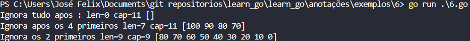

# Introcução a Linguagem golang

A extensão usada pela linguagem é o .go. 

O primeiro passo para que o arquivo seja executavél é a utilização do:

```go

package main  // usado para dizer onde esta o pacote a ser usado 

import (
     "fmt"
)
   

//Para o Go toda função precisa ter uma função man para executar os códigos 


func main(){

    fmt.Println("Olá, mundo!")

}


```

No go todos os programas são organizados em pacotes, um pacote é um grupo de arquivos que estão em um mesmo local e eles são compilados juntos. Dessa forma todos os arquivos serão compartilhados entre todos os pacotes. No programa acima podemos vê como se criar um código simples que mostre a mensagem olá mundo.

Um outro exemplo simples: 
```go
package main // usado para dizer onde esta o pacote a ser usado

import (
	"fmt"
	"math/rand"
)

func main() {
	fmt.Println("my favorite Number is", rand.Intn(10))
}

```

### Variavéis no GO
Para declaramos a uma variavel podemos usar a palavra reserva da linguagem **var** e logo após o time de dado ao qual a variavel irá receber.

Exemplo: ``` nome var string ```

A instrução ```var``` pode ser usada no escopo de pacote ou de método/função, a instrução var pode incluir inicializadores, um por variável. Neste caso, não é necessário informar o tipo pois o mesmo será inferido.

```go 
package main

import(
	"fmt"
	"math"
)


var  c, python, java
func main (){
	var i int 
	fmt.Println(i, c, python, java)
}


```

* Dentro de uma função, o operador de declaração curta **:=** , pode ser usado ao invés do operador var, ao usar o operador de declaração curta o mesmo iniciará as variáveis

Digitando o comando ```go env``` é possível vê as variaveis de ambiente do go
O código  ```GOPATH: endereço go``` serve para guardar o binario implementados.

todos os ´´´packages´´´ usados no GO teram que possuir o mesmo nome da pasta onde o arquivo esta armazenado, tirando o ´´´main´´´ pois é onde estará as principais funções 

#### Declarando uma variavel 

```Go

package main 

const a = "Hello Wolrd"

var b bool

b = true 

func main(){
	println(b)
}

```

```Go 
//Declaração de Escobo Global 

var (
	c int
	b bool
)
```

Variaveis e Importes que não são usados o Go reclama e gera um erro.

É possível ainda declarar variaveis na forma de sort slice é usado para simplificar as declarações de variaveis.

```Go

package main 


func main(){
	a := "Felix" //Tipo String
	b := 23 // Tipo int

	println(a)
}
```

# Tipagem de dados em GO

```GO
package main

const a = "Hello Wolrd"
type ID 

var (
	c int     = 9
	b bool    = true
	d float64 = 2.3
	e string  = "Felix"
	f ID = 1 
)

func main() {
	b = true
	println(b)
	println(c)
}

```

O "fmt" é um pacote usado para formatação dos dados exibidos

```GO
package main

import "fmt"

const a = "Hello Wolrd"
type ID int 

var (
	c int     = 9
	b bool    = true
	d float64 = 2.3
	e string  = "Felix"
	f ID = 1 
)

func main() {

	fmt.print("Esse é o tipo de %t", f)
}

```

### Array, Slice, maps no GO

Um array é como uma variavel "lista" na qual podemos armazena algum tipo de dentro da mesma, abaixo poderemos vê como declarar um array em Go.

```var meuArray [3]int``` => logo podemos vê que meuArray:= [3]int => "nome := [tamanho]tipo"

```Go

package main

import "fmt"


func main() {
	var meuArray [3]int

	meuArray[0] = 10
	meuArray[1] = 20
	meuArray[2] = 30

	//Percorrendo o Array
	// o for usa o indice e o valor, e também o range que é usado para percorrer todo o array

	for i, v := range meuArray{
		fmt.Println("Percorrendo o array/vetor %d no indice com valor %d", i,v)
	}
}


```
Obs: O array possui tamanho Fixo, após sua criação

#### Slice 

O slice é um tipo de array, que possui um ponteiro e uma capacidade.

``` meuArray := []int {10, 9, 8, 7, 6, 5, 4, 3, 2, 1, 0}``` => nome := []tipo {valor1, valor2, valor3 ...}

```Go
package main

import "fmt"

func main() {

	s := []int{10, 9, 8, 7, 6, 5, 4, 3, 2, 1, 0}

	fmt.Printf("len=%d cap=%d %v \n", len(s), cap(s), s)
}
```

Podemos usar o ```len(s[:0]) para fazer com que todos os dados inseridos a direita no slice sejam desconsiderados ou zerados.

```Go
package main

import "fmt"

func main() {


	s := []int{100, 90, 80, 70, 60, 50, 40, 30, 20, 10, 0}

	fmt.Printf("Ignora tudo apos : len=%d cap=%d %v \n", len(s[:0]), cap(s[:0]), s[:0])

	fmt.Printf("Ignora apos os 4 primeiros len=%d cap=%d %v \n", len(s[4:]), cap(s[:4]), s[:4]) //Reduziu  a capacidade

	fmt.Printf("Ignora os 2 primeiros len=%d cap=%d %v \n", len(s[2:]), cap(s[2:]), s[2:])


}
```

**Saída:** 




```s = append(s, 110) ``` Usado para adcionar valores no slices, e redimensiona o slice dobrando o tamanho.


### maps ou hashtable 

```Go

package main

import "fmt"

func main() {

	salario := map[string]int{"Felix": 700, "Tadeu": 3200, "Natalia": 20000}

	fmt.Println("O salario do Funcionario é: ", salario["Felix"])

	delete(salario, "Felix")
	salario["felix"] = 1000

	fmt.Println("Apos ser contratado o salario do Funcionario é: ", salario["felix"])
}


``` 

A função ```make``` pode ser usada para criar uma determinada variavel e inicializar as variaveis

```go
package main

import "fmt"

func main() {

	salario := map[string]int{"Felix": 700, "Tadeu": 3200, "Natalia": 20000}

	fmt.Println("O salario do Funcionario é: ", salario["Felix"])

	delete(salario, "Felix")
	salario["felix"] = 1000

	fmt.Println("Apos ser contratado o salario do Funcionario é: ", salario["felix"])

	sal := make(map[string]int)
}
```


O blank identi fier "_" é usado para ignorar uma das seções do ```for``` e manter o seu funcionamento mesmo sem esse componente.

```Go

package main

import "fmt"

func main() {

	salario := map[string]int{"Felix": 700, "Tadeu": 3200, "Natalia": 20000}

	fmt.Println("O salario do Funcionario é: ", salario["Felix"])

	delete(salario, "Felix")
	salario["felix"] = 1000

	fmt.Println("Apos ser contratado o salario do Funcionario é: ", salario["felix"])

	sal := make(map[string]int)

	sal["Felix"] = 1000

	for nome, salario := range salario {
		fmt.Printf("O salario é de %s e %d\n", nome, salario)
	}

	for _, salario := range salario {
		fmt.Printf("O salario é de %s e %d\n", nome, salario)
	}
}

```


### Funções no GO 

Passa dados na entrada e sai dados na saida e todas as suas possibilidades possiveis de entrada e saida 

**Exemplo**

```Go

// Aula Sobre Funções no GO

// Função main
package main

import "fmt"

func main() {

	//Chamando a função em GO
	a := sum(1, 2)

	fmt.Printf("Func Soma = %d \n", a)
	// Imprimindo e fazendo a chamada

	fmt.Printf("O valor da função soma é %d", sum(1, 2))

}

// Primeira função em Go
func sum(a int, b int) int {
	return a + b
}

// Se a e b são do mesmo tipo podemos fazer da seguinte forma

func sum(a, b int) int{
	return a + b
}
```

No Go é possível que uma função retorne mais de um valor ao mesmo tempo: 

```Go
func sum(a, b int) (int,bool){
	if a + b >= 50{
		return a + b, true
	}
	
	return a + b, false 
}
```
O GO não possui as funções de resolução de erro. A função error é uma função usada para solução de problemas e correções de bugs com retorno.

```Go
func sum(a, b int) (int,error){
	if a + b >= 50{
		return a + b, true
	}
	
	return 0, new.error("A soma é menor que 50") 
}
```

Voce pode utilizar o ultimo valor de uma função para verificar se houve um erro na função, assim usando o error como tratamento de dados.
```GO
// Aula Sobre Funções no GO

// Função main
package main

import (
	"errors"
	"fmt"
)

func main() {

	//Chamando a função em GO
	//a := sum(1, 2)

	//fmt.Printf("Func Soma = %d \n", a)
	// Imprimindo e fazendo a chamada

	//fmt.Println(sum(105, 2))

	//Criando uma nova variavel para armazenar o valor e outra para o error
	valor, err := sum(51, 10)

	if err != nil {
		fmt.Println(err)
	}

	fmt.println(valor)

}

// Primeira função em Go
//func sum(a, b int) (int, bool) {
//	if a+b >= 50 {
//		return a + b, true
//	}

//	return a + b, false
//}

func sum(a, b int) (int, error) {
	if a+b >= 50 {
		return a + b, nil // O erro aqui é vazio logo não existe
	}

	return 0, errors.New("A soma é menor que 50")
}
```